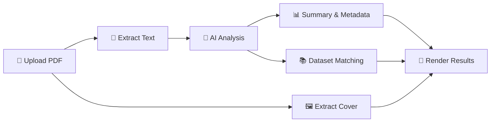

<h1 align="center">📚 Smart Book Reader</h1>

<p align="center">
  <strong>AI-Powered Book Analysis — Upload a PDF and get instant insights</strong>
</p>

<p align="center">
  
  
  
  
</p>

<p align="center">
  <a href="#-features">Features</a> •
  <a href="#-demo">Demo</a> •
  <a href="#-quick-start">Quick Start</a> •
  <a href="#-project-structure">Structure</a> •
  <a href="#-tech-stack">Tech Stack</a> •
  <a href="#-license">License</a>
</p>

---

## ✨ Features

| Feature | Description |
|---------|-------------|
| 📄 **PDF Upload & Parsing** | Extract text from the first 30 pages of any PDF book using PyMuPDF |
| 🖼️ **Cover Extraction** | Automatically renders the first page as a high-quality cover image |
| 🧠 **AI-Powered Analysis** | Get a summary, main idea, genre, sub-genre, mood, themes, and age recommendation |
| 🌍 **Bilingual Support** | Full Arabic (RTL) & English UI — the AI adapts its response language accordingly |
| 📚 **Book Recommendations** | Cross-references AI-detected genre with local CSV datasets to suggest similar reads |
| 🌓 **Dark / Light Theme** | Toggle between premium dark and light modes |
| ⚡ **Cached Processing** | Results are cached so switching themes/languages doesn't re-run the AI |

---

## 🎬 Demo

<p align="center">
  <em>Upload any PDF → get AI insights in seconds</em>
</p>

```
1. Choose a PDF file
2. Click "🔍 Analyze Book"
3. View cover, summary, genre, themes & recommendations
```

---

## 🚀 Quick Start

### Prerequisites

- **Python 3.10+** installed on your machine

### Installation

```bash
# 1. Clone the repository
git clone https://github.com/<your-username>/Smart-Book-Reader.git
cd Smart-Book-Reader

# 2. Create a virtual environment (recommended)
python -m venv venv
source venv/bin/activate        # macOS / Linux
venv\Scripts\activate           # Windows

# 3. Install dependencies
pip install -r requirements.txt

# 4. Run the app
streamlit run app.py
```

The app will open in your browser at **http://localhost:8501** 🎉

---

## 📁 Project Structure

```
Smart-Book-Reader/
├── app.py                # Main Streamlit application (UI, themes, layout)
├── analyzer.py           # PDF extraction, AI analysis, dataset recommendations
├── requirements.txt      # Python dependencies
├── assets/
│   └── banner.png        # README banner image
├── Datasets/
│   ├── jamalon dataset.csv    # Arabic book dataset (~7 MB)
│   ├── books.csv              # English book dataset (~1.5 MB)
│   └── books_datasets.csv     # Supplementary Arabic dataset (~42 KB)
├── .gitignore
└── README.md
```

---

## 🧩 How It Works



1. **PDF Processing** — PyMuPDF extracts text (first 30 pages) and renders the cover at 2× resolution.
2. **AI Analysis** — Text is sent to an LLM (via g4f) with a structured JSON prompt, producing summary, genre, mood, themes, and age range.
3. **Recommendations** — The detected category is matched against local CSV datasets (Jamalon for Arabic, Goodreads-style for English) to surface similar books.
4. **Rendering** — Results are displayed in a premium glassmorphism UI with RTL support for Arabic.

---

## 🛠️ Tech Stack

| Layer | Technology |
|-------|-----------|
| **Frontend** | Streamlit + Custom CSS (glassmorphism, gradients, RTL) |
| **PDF Engine** | PyMuPDF (fitz) |
| **AI Backend** | g4f (GPT-4 / GPT-3.5 fallback, no API key needed) |
| **Data** | Pandas + local CSV datasets |
| **Fonts** | Google Fonts — Inter, Playfair Display, Tajawal |

---

## 📝 Configuration

### Language & Theme

The sidebar provides runtime controls:
- **🌐 Language** — Switch between العربية (Arabic) and English
- **🌓 Dark Mode** — Toggle the dark/light theme

### Swapping the AI Provider

The AI logic lives in [`analyzer.py`](analyzer.py) → `analyze_with_llm()`. You can replace the `g4f` calls with any provider:

```python
# Example: OpenAI
import openai
response = openai.ChatCompletion.create(
    model="gpt-4",
    messages=[{"role": "user", "content": prompt}],
)
```

---

## 🤝 Contributing

Contributions are welcome! Feel free to:

1. Fork the repo
2. Create a feature branch (`git checkout -b feature/awesome`)
3. Commit your changes (`git commit -m 'Add awesome feature'`)
4. Push to the branch (`git push origin feature/awesome`)
5. Open a Pull Request

---


<p align="center">
  Made by Anas ALshammari
</p>
